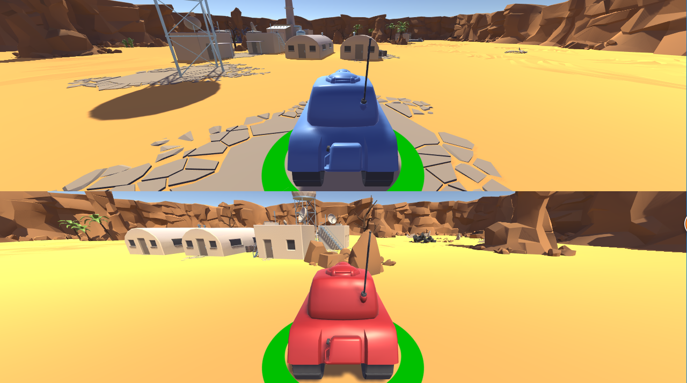

# My tank game

> In Tanks, I expand the game and will update as often as I can for practicing.

## version 1.2

add close view of players and each player has one camera follows.

## version 1.1

Original game done by following the tutorial of Unity Boston 2015

### Player 1:

> movement: key 'W' and key 'S'
>
> rotation: key 'A' and key 'D'
>
> fire: key 'SPACE' (hold for farther shooting) 

### Player 2:

>movement: key 'UP' and key 'Down'
>
>rotation: key 'LEFT' and key 'RIGHT'
>
>fire: key 'ENTER' (hold for farther shooting) 